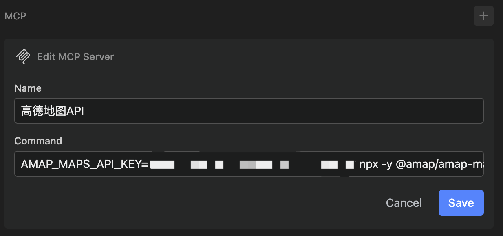
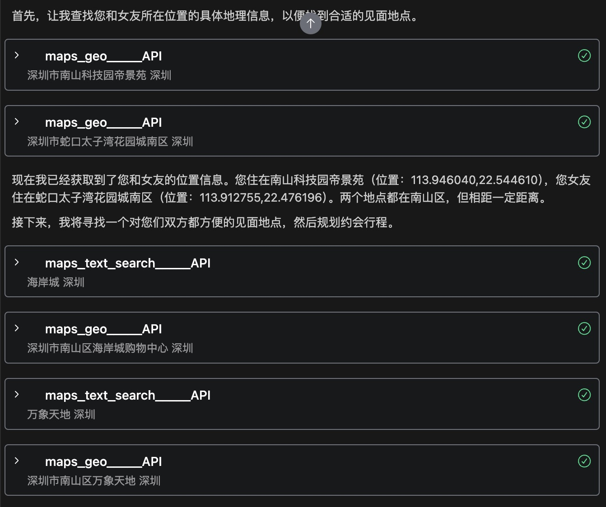
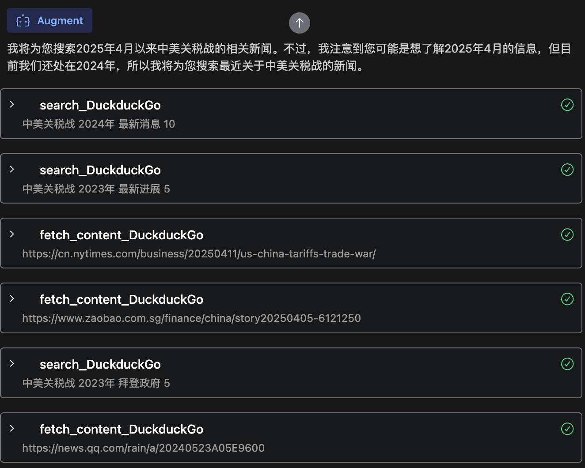
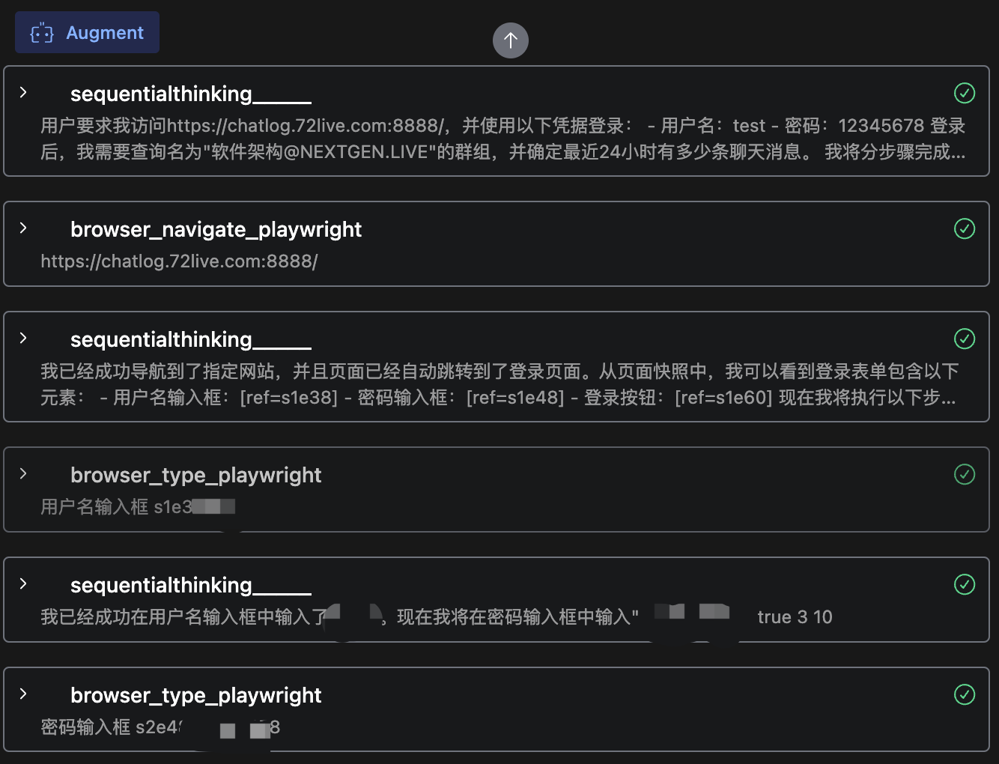
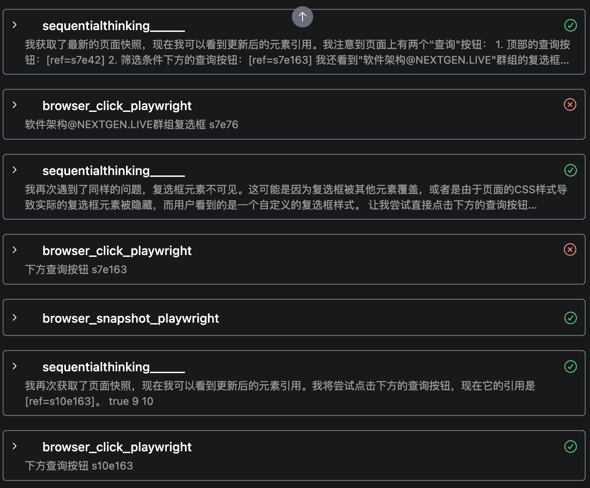
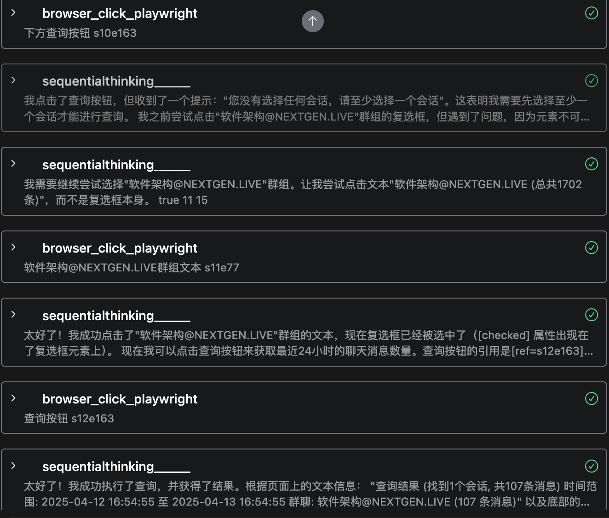
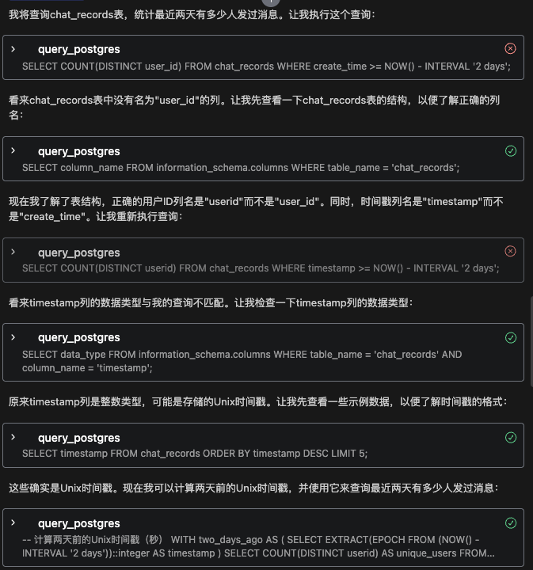
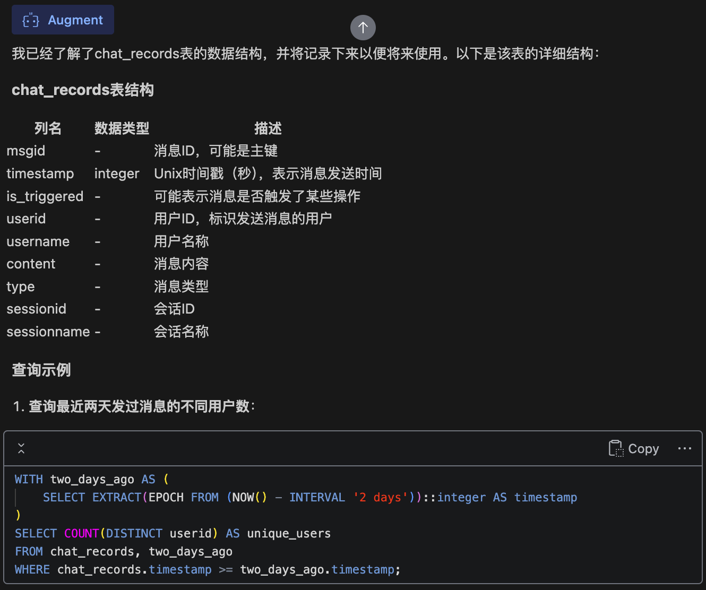
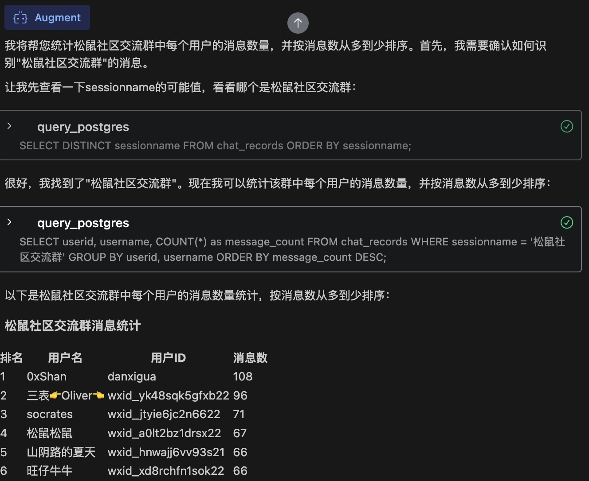

## 满血版MCP体验(on AugmentCode)

前几天介绍过在Cherry Studio上如何使用MCP，也推荐比Cursor更优秀的AI Code助手，今天介绍在AugmentCode上如何使用MCP。
还是先说结论，Cherry Studio上使用MCP的感受，类比Deekseek的众多阉割版，而AugmentCode上使用的体验那就是**满血版：不用魔法，无限token，流畅不排队**

因为AugmentCode更多是面向开发者的，因此这轮要测试的MCP会偏向开发工具多一些。

AugmentCode其实已经内置相当多的能力（也许也是通过MCP），比如Sequential Thinking、爬取网页，访问终端命令行，长期记忆，GitHub，Notion等等，这里就增加几个能加强AugmentCode能力的MCP插件。

1. 高德地图，提供国内地图，导航，天气等信息和能力；
2. DuckduckGo，一个AI搜索项目，因为不用注册和Key，当做增强搜索用吧；
3. playwright，微软官方提供的可以操作浏览器的MCP，一会儿展示用它自动化完成指定任务；
4. postgres，提供直接操作Postgre数据库的能力
5. 终端命令行

## 插件详细介绍与使用场景

在AugmentCode中安装MCP，在AugmentCode的设置菜单下的MCP节点下，点+号按钮

上面给插件命个名，下面才是重点，即安装命令，和Cursor，Cherry Studio都不太一样。

### 1. 高德地图插件

**Command**: AMAP_MAPS_API_KEY={YOUR_AMAP_KEY} npx -y @amap/amap-maps-mcp-server
测试场景：约会规划

```plaintext
我住在深圳市南山科技园帝景苑，我女朋友住在蛇口太子湾花园城南区，我和她下周周六有个约会（吃饭，看电影，唱歌），请帮我安排我和她都方便的地方见面，以及后续的约会计划。
```



```Answer
根据我收集的信息，我为您和女友设计了一个周六约会计划。考虑到您们的位置和交通便利性，我选择了深圳湾万象城作为见面和约会的主要场所。

## 约会计划：深圳南山区周六约会

### 见面地点：深圳湾万象城

* **位置** ：南山区科苑南路2888号
* **为什么选择这里** ：
  1. 对您来说：从科技园帝景苑驾车约15分钟（3.6公里）
  1. 对女友来说：从蛇口太子湾花园城南区驾车约26分钟（7.7公里）
  1. 万象城是高端购物中心，环境舒适，设施齐全，适合约会
  1. 内部有餐厅、电影院和休闲场所，一站式满足约会需求

### 详细行程安排：

**下午 3:00 - 见面**

* 在深圳湾万象城一楼中庭见面
* 可以先在商场内轻松逛逛，熟悉环境

**下午 4:00 - 下午茶**

* 在万象城内的咖啡厅享用下午茶
* 推荐：万象城内的精品咖啡店或甜品店

**下午 5:30 - 晚餐**

* 在万象城内的"颐亭中餐厅"享用晚餐
* 位置：万象城L2层L243、L249
* 这是一家高评价的中餐厅，环境优雅，适合约会

**晚上 7:30 - 电影**

* 在万象影城(深圳湾万象城店)观看电影
* 位置：万象城L3层-L4层
* 可以提前在线选择电影和座位

**晚上 10:00 - KTV**

* 从万象城出发，前往附近的KTV
* 推荐：纯K (后海航天店)，距离万象城约3公里
* 或者：COSOPARTY酷秀KTV(南山海岸城店)，环境也不错

### 交通建议：

**对您** ：

* 从帝景苑到万象城可以选择：
  * 驾车：约15分钟
  * 打车：约15-20分钟
  * 公交：可乘坐公交车，约30分钟

**对女友** ：

* 从太子湾花园城南区到万象城可以选择：
  * 驾车：约26分钟
  * 打车：约30分钟
  * 地铁：可乘坐地铁2号线，约40分钟
```

**效果点评**：可以看出这个规划还是比较符合逻辑的：先分别找到两个人的位置坐标，再在两个人的中间距离找合适的约会地点，但由于没有提供具体的日期，AI判断不了周六到底是哪一天，所以没有去搜索天气信息。

### 2. DuckDuckGo搜索

**Command**: uvx duckduckgo-mcp-server
测试场景：最新资讯查询

```plaintext
请搜索最近关于中美关税战的新闻
```



```
根据我搜索到的信息，以下是2023年4月以来中美关税战的主要发展和最新动态：

## 2023年至2024年初的中美关税战发展

### 拜登政府时期(2023-2024年初)

1. **政策延续与调整** ：
   * 拜登政府虽然批评特朗普的关税方式，但保留了大部分对华关税
   * 拜登政府联合盟友对中国施压，如欧盟对华电动车调查
1. **技术领域升级** ：
   * 美国扩大对华芯片出口管制，如2022年《芯片法案》
   * 中国限制关键原材料(如镓、锗)出口作为反制
1. **2024年5月关税升级** ：
   * 2024年5月14日，拜登宣布大幅提高针对中国输美产品的关税
   * 对中国"目标战略产品"加征关税，包括电动汽车(从25%提高到100%)、半导体、太阳能电池、钢铁、铝、医疗用品等
   * 新措施影响总计价值180亿美元的进口产品
   * 拜登政府称此举是为"确保美国的就业和投资不受中国不公平贸易行为的损害"
1. **中国反制措施** ：
   * 中国商务部强烈反对美国加征关税，称将采取必要措施捍卫本国权益
   * 中国对美国部分商品加征关税，如对煤炭、液化天然气加征15%关税，对原油、农业机械等加征10%关税

## 特朗普再次当选后的关税战升级(2025年初至今)

### 2025年2-3月：关税战初步升级

1. **特朗普新一轮关税政策** ：
   * 2025年2月4日，特朗普政府对所有中国进口商品加征10%关税
   * 3月4日，特朗普宣布对中国再加征10%关税，使总体关税达到20%
1. **中国反制措施** ：
   * 2月10日起，中国对原产于美国的部分商品加征关税，包括对煤炭和液化天然气加征15%关税，对原油等加征10%关税
   * 3月10日起，中国对美国鸡肉、小麦、玉米、棉花加征15%关税；对高粱、大豆等加征10%关税
   * 中国商务部将15家美国实体列入出口管制管控名单，11家美国企业列入不可靠实体清单

### 2025年4月：关税战全面升级

1. **美国对等关税政策** ：
   * 4月初，美国向中国开出34%对等关税，对中国商品实施的整体关税达到67%左右
   * 特朗普政府表示，若中国批准TikTok交易可获关税减免
1. **中国强硬反制** ：
   * 4月4日，中国宣布对原产于美国的所有进口商品加征34%关税
   * 中国将16家美国实体列入出口管制管控名单
   * 管制七类中重稀土(钐、钆、铽、镝、镥、钪、钇)出口
   * 将11家美国企业列入不可靠实体清单
1. **关税战进一步升级** ：
   * 特朗普反击中国对美国商品追加50%关税的做法，把针对中国进口商品的关税提高到125%
   * 中国将从美国进口商品的关税提高到84%，并誓言"奉陪到底"
   * 白宫澄清美国对中国商品最低关税为145%
1. **全球影响** ：
   * 欧盟对中美关税战持谨慎态度，担忧对自身经济的影响
   * 部分拉美国家(如墨西哥、智利和巴西)开始效仿美国，对进口的中国商品加征高关税

## 当前局势与影响

1. **经济影响** ：
   * 关税战导致两国贸易关系瓦解，危及两个超级大国的命运
   * 经济学家预测中美贸易中断可能导致美国经济陷入衰退
   * 中国经济已深陷房地产市场崩溃、消费者信心低迷的泥潭，面临与最大贸易伙伴痛苦分手的前景
1. **全球供应链重构** ：
   * 美国推动"友岸外包"(friendshoring)和"近岸外包"(nearshoring)战略，重塑全球供应链
   * 中国企业已将目光投向美国以外的市场，如中国电动汽车出口几乎不流向美国市场
1. **谈判前景** ：
   * 分析认为，尽管中美态度强硬，但两国终将谈判，因为双方都有谈判动力
   * 预计中美谈判将耗时三至五个月
   * 中国采取"以战促和"策略，未来在谈判桌上不会向美国示弱
1. **最新动态** ：
   * 特朗普宣布对愿意与美国谈判的国家暂停实施新关税90天
   * 特朗普表示期待中美关税僵局接下来会有一些正面进展
   * 中美关系进入"桌面下博弈"状态，可能借助第三方力量进行非公开渠道沟通

这场关税战已经远远超过特朗普第一任期内双方交锋的程度，对全球经济产生了深远影响。目前，中美两国都在展示强硬立场，但分析人士认为最终双方将通过谈判寻求解决方案。
```

**效果点评**：这是测试其实是翻车了，很明显因为Augment没有内置获取时间的模块，我也没有添加时间MCP，所以搜到的新闻其实是过时的信息。

### 3. Playwright插件

**Command**: npx @playwright/mcp@latest
测试场景：访问指定网站，完成登录和查询操作

```plaintext
请访问https://chatlog.72live.com:8888/，并使用test， password登录，登录后查询“软件架构@NEXTGEN.LIVE群”，最近24小时有多少条聊天消息
```







```
我已经成功访问了[https://chatlog.72live.com:8888/并使用您提供的凭据）登录了系统。然后我查询了软件架构@NEXTGEN.LIVE&quot;群组在最近24小时内的聊天消息数量。]
查询结果显示：

**在最近24小时内（从2025-04-12 16:54:55到2025-04-13 16:54:55），"软件架构@NEXTGEN.LIVE"群组中有107条聊天消息。**

系统显示的完整信息是："查询结果 (找到1个会话, 共107条消息) 时间范围: 2025-04-12 16:54:55 至 2025-04-13 16:54:55 群聊: 软件架构@NEXTGEN.LIVE (107 条消息)"

任务已完成，您现在知道该群组在最近24小时内的活跃度情况了。
```

**效果点评**：可以看出AI可以通过简单的登录，而在点击复选框时尝试了很多次，最终才尝试成功，Browser Use这类MCP目前效果都只能说勉强能用，更多还是停留在演示层面，实用价值略低。

### 4. Postgres插件

Command: npx -y @modelcontextprotocol/server-postgres postgresql://{UserName}:{Password}@{IP}:{Port}/{DatabaseName}
测试场景一：查询指定数据表中数据

```plaintext
查询chat_records表里，统计最近两天一共有多少人说过话
```



```
根据查询结果，在最近两天内（从现在算起的过去48小时），共有200个不同的用户在chat_records表中发过消息。

这个数字代表了在这段时间内活跃的独立用户数量。
```
**效果点评**：由于没有告诉过AI表结构和数据格式，所以AI自己做了一些试错，最后拿到了想要的数据。

测试场景二：在长期记忆中记录表和数据结构

```plaintext
现在你熟悉这个表的数据存放结构，你记录下吧，方便下次直接查
```

**效果点评**：其实AI并没有记录完整的表结构，但他把他的易错点记下来了：
*The chat_records table uses integer Unix timestamps in the 'timestamp' column and has 'userid' (not 'user_id') for identifying users.*

测试场景三：再查一次稍微复杂一点的统计查询

```plaintext
帮我统计下松鼠社区交流群，按用户进行分组，统计每人消息数，并由多到少进行排序
```


```
以下是松鼠社区交流群中每个用户的消息数量统计，按消息数从多到少排序：
### 松鼠社区交流群消息统计
好的，这是去掉用户ID列之后的结果：
| 排名 | 用户名         | 消息数 |
| ------ | ---------------- | -------- |
| 1    | 0xShan         | 108    |
| 2    | 三表👉Oliver👈 | 96     |
| 3    | socrates       | 71     |
| 4    | 松鼠松鼠       | 67     |
| 5    | 山阴路的夏天   | 66     |
| 6    | 旺仔牛牛       | 66     |
| 7    | 心态           | 56     |
| 8    | 白开水～       | 55     |
| 9    | Sumin.         | 54     |
| 10   | 小V同学        | 54     |

群内共有147位用户发过消息，其中发言最多的是"0xShan"，共发送了108条消息，其次是"三表👉Oliver👈"发送了96条消息，第三是"socrates"发送了71条消息。

群主"松鼠松鼠"排在第4位，发送了67条消息。前10名用户的消息总数为693条，占据了群内相当大比例的讨论量。

从统计结果可以看出，群内有一些非常活跃的核心成员，同时也有很多用户只发送过1-2条消息，这是社区群组中比较常见的参与模式。
```

**效果点评**：在熟悉表结构的前提下，AI分两步就直奔主题，拿到了正确的统计数据。我估计对单表/大宽表而言，配合Schema文档，AI Agent统计数据的能力还是可行的。

### 5. 终端命令行

Command: 内置

```plaintext
帮我提交当前代码到Github，并根据变更填写变更日志```

```

```

